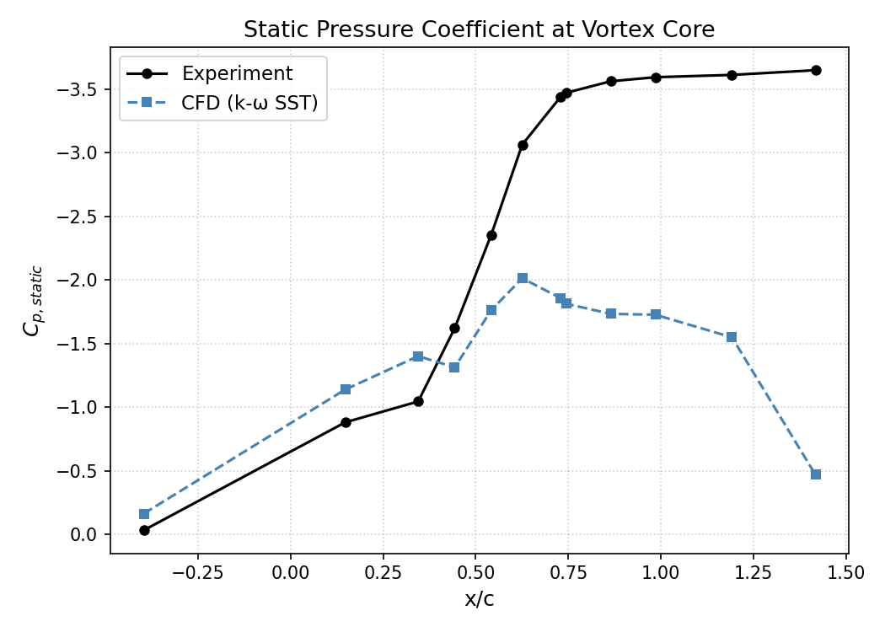
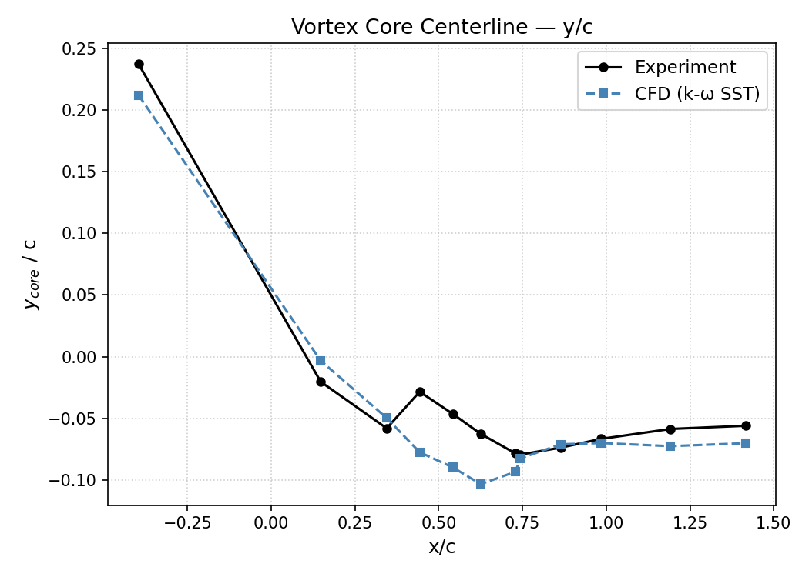
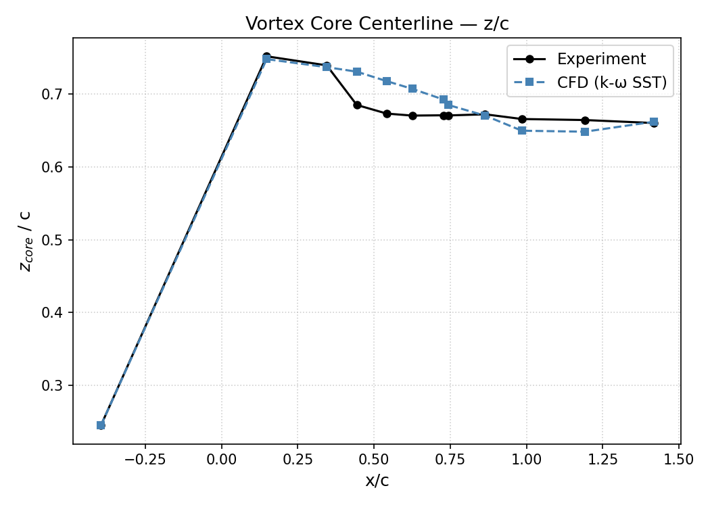
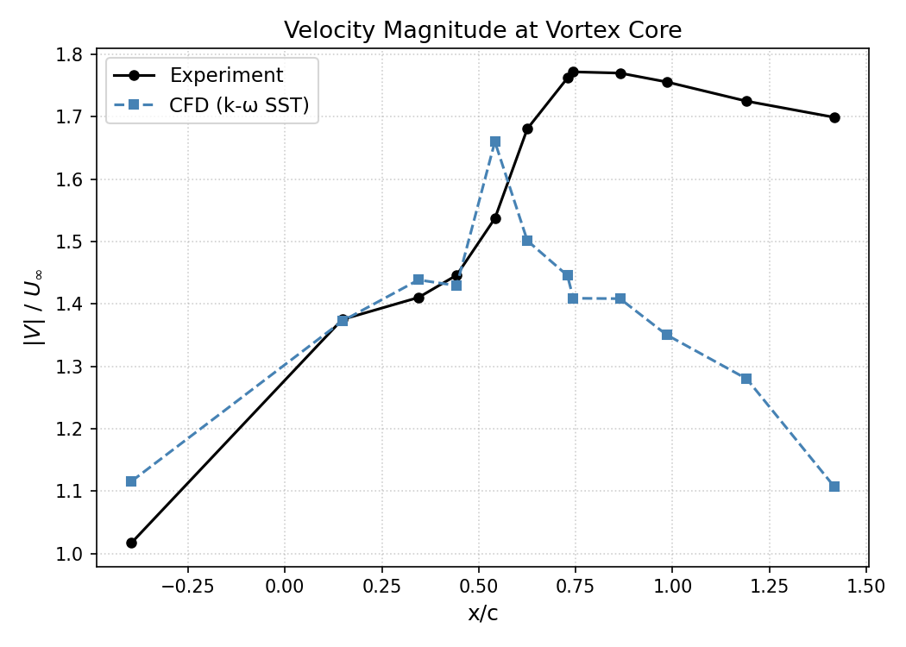

# NACA 0012 Wingtip Vortex — OpenFOAM Case

Numerical simulation of the near-field wingtip vortex flow over a half-span **NACA 0012** wing using OpenFOAM (`pimpleFoam`), validated against the NASA Ames experimental dataset of Chow, Zilliac & Bradshaw (1997).

> **Reference experiment:**
> [NASA Turbulence Modeling Resource — Exp: Flow Behind a NACA 0012 Wingtip](https://tmbwg.github.io/turbmodels/Other_exp_Data/wingtip0012_exp.html)

---

## Table of Contents

- [How to Run This Case](#how-to-run-this-case)
- [Case Overview](#case-overview)
- [Geometry](#geometry)
- [Flow Conditions](#flow-conditions)
- [Turbulence Model & Initial Conditions](#turbulence-model--initial-conditions)
- [Experimental Data Files](#experimental-data-files)
- [Post-Processing & Validation](#post-processing--validation)
- [Results](#results)
- [Repository Structure](#repository-structure)
- [License](#license)

---

## How to Run This Case

1. **Generate geometry**
```bash
   python geometry/generate_wing.py
```
   Copy the generated surface into `OpenFOAM/constant/triSurface/` (already done for this case).

2. **Preprocess experimental data → probe coordinates**
```bash
   python scripts/preprocess/main.py
```

3. **Write OpenFOAM probe dictionaries**
```bash
   python scripts/postprocess/write_probes.py
```

4. **Run the case**
```bash
   openfoam<version>
   blockMesh
   surfaceFeatureExtract
   snappyHexMesh -overwrite
   decomposePar
   mpirun -np 8 pimpleFoam -parallel | tee log.pimpleFoam
   reconstructPar
```

5. **Sample probes from the solved case**
```bash
   # Compute grad(U) field
   postProcess -func gradU_compute -latestTime

   # Rename grad(U) → gradU  (parentheses break OpenFOAM dict parsing)
   cp 'OpenFOAM/<latestTime>/grad(U)' 'OpenFOAM/<latestTime>/gradU'

   # Sample all three probe sets
   postProcess -func probes_v   -latestTime
   postProcess -func probes_p   -latestTime
   postProcess -func probes_b11 -latestTime
```

6. **Parse probe results and run the analysis**
```bash
   python scripts/postprocess/parse_results.py
   python scripts/postprocess/main.py
```

   This produces `metrics_*.csv`, `core_tracking.csv`, and the comparison plots in `scripts/results/plots/` — see [Results](#results).

---

## Case Overview

The experiment was conducted at NASA Ames Research Center and focused on characterising the complete mean flowfield and Reynolds stress tensor in the near field of a wingtip vortex. The wing is a half-span NACA 0012 model mounted on the wind tunnel wall, with a rounded wingtip formed by rotating the NACA 0012 profile about its symmetry axis.

Key tunnel and model dimensions:

| Parameter | Value |
|---|---|
| Wind tunnel test section | 48 in × 32 in |
| Wing chord | 48 in (4 ft) |
| Wing semispan (constant-chord region) | 33.12 in |
| Overall span to tip (quarter-chord) | 36 in |
| Trailing edge thickness | 0.100 in |
| Transition | Tripped near leading edge |

---

## Geometry

The 3-D wing surface geometry is generated programmatically via:

```
geometry/generate_wing.py
```

The script builds the NACA 0012 cross-section, extrudes the constant-chord semispan, and applies the rounded wingtip (NACA 0012 profile rotated about its symmetry axis). Output is suitable for direct import into the OpenFOAM meshing pipeline.

The coordinate system used in the simulation follows the **wing-fixed, right-handed** convention:

| Axis | Direction |
|---|---|
| X | Chordwise, origin at leading edge / root |
| Y | Upward (normal to chord plane) |
| Z | Spanwise, positive toward tip |

> Note: the experimental data files use a **left-handed, traverse-based** coordinate system. Transformation equations to convert to the right-handed wing system are provided in `README2.DAT` and summarised below:
>
> ```
> xnew = x + xtrans        xtrans =  0.75 * chord * cos(AOA) + 0.25
> ynew = y + ytrans        ytrans = -0.75 * chord * sin(AOA) - 5.3588
> znew = ztrans - z        ztrans =  39.7714
> ```
> where `chord = 48.0 in` and `AOA = 10.0 * π / 360.0 rad`.

---

## Flow Conditions

| Parameter | Value |
|---|---|
| Freestream velocity, U∞ | 170 ft/s (≈ 51.82 m/s) |
| Reynolds number (based on chord) | 4.6 × 10⁶ |
| Angle of attack | 10 deg |
| Max freestream turbulence intensity | 0.15 % |
| Working fluid | Air (incompressible) |

---

## Turbulence Model & Initial Conditions

The case uses the **k-ω SST** turbulence model (`kOmegaSST` in OpenFOAM).

Initial / boundary conditions derived from freestream turbulence intensity `I = 0.0015` and freestream velocity `U`:

### Turbulent kinetic energy — `k`

```
k = 1.5 * (U * I)²
```

| Symbol | Value |
|---|---|
| k (freestream) | 0.00906153 m²/s² |

### Specific dissipation rate — `ω`

```
ω = k^0.5 / (Cμ^0.25 * l)
```

where `Cμ = 0.09` and `l` is the turbulent length scale (taken as chord length).

| Symbol | Value |
|---|---|
| ω (freestream) | 0.078077484 1/s |

### Turbulent dissipation rate — `ε`

```
ε = Cμ * k^1.5 / l
```

| Symbol | Value |
|---|---|
| ε (freestream) | 0.000636751 m²/s³ |

> **Reference formulas:**
> [CFD Online - Turbulence free-stream boundary conditions](https://www.cfd-online.com/Wiki/Turbulence_free-stream_boundary_conditions)

### OpenFOAM `turbulenceProperties`

```cpp
simulationType      RAS;

RAS
{
    RASModel        kOmegaSST;
    turbulence      on;
    printCoeffs     on;
}
```

---

## Experimental Data Files

The experimental dataset (provided via the TMR page) contains 13 files:

| File | Contents |
|---|---|
| `TAKALL.DAT` | Mean velocity field (u, v, w) / U∞ |
| `RETAKALL.DAT` | Pressure field — Cp,static and Cp,total |
| `TAK3W1C.B11` – `TAK3W10C.B11` | Triple-wire: mean velocity, RMS, Reynolds shear stresses (10 planes) |
| `CHORDQPL.DAT` | Wing surface pressure — 24 chordwise Cp blocks |

### Surface pressure blocks (`CHORDQPL.DAT`)

24 blocks covering spanwise stations `Z = 6 – 32 in` (constant-chord region) and `θ = 10° – 90°` (rounded wingtip). Each block has 4 columns:

| Column | Quantity |
|---|---|
| 1 | Surface tap row number (chordwise) |
| 2 | x/c |
| 3 | y/c |
| 4 | Cp |

### Velocity / pressure probe data

- `TAKALL.DAT`: columns 1–3 = (x, y, z) in inches; columns 4–6 = u/U∞, v/U∞, w/U∞.
- `RETAKALL.DAT`: columns 1–3 = (x, y, z) in inches; column 5 = Cp,static; column 6 = Cp,total.
- `TAK3W*.B11`: column 1 = point index; columns 2–4 = (x, y, z); columns 5–7 = mean velocity; columns 8–10 = RMS; columns 11–13 = Reynolds shear stresses.

> **Note:** the `w/U∞` component from the probe files must be multiplied by **−1** to be consistent with the right-handed coordinate system.

---

## Post-Processing & Validation

Simulation results are extracted at the same spatial locations as the experimental probes and compared directly. The workflow is split into two stages.

### Stage 1 — Preprocessing (experimental data → probe coordinates)

Scripts in `scripts/preprocess/` parse the raw experimental data files, apply the coordinate transformation from the traverse system to the wing-fixed right-handed system, and write the probe coordinate CSVs used by OpenFOAM.

| Script | Role |
|---|---|
| `main.py` | Entry point — orchestrates the full preprocessing pipeline |
| `parse_b11.py` | Parses `TAK3W*.B11` triple-wire files |
| `parse_pv_info.py` | Parses `TAKALL.DAT` and `RETAKALL.DAT` |
| `transform_coords.py` | Applies traverse → wing coordinate transformation |

Output coordinate CSVs written to `scripts/results/`:

| File | Probe set | Count |
|---|---|---|
| `openfoam_coords_v.csv` | Velocity planes (`TAKALL.DAT`) | 7 280 |
| `openfoam_coords_p.csv` | Pressure planes (`RETAKALL.DAT`) | 4 000 |
| `openfoam_coords_b11.csv` | Triple-wire planes (`TAK3W*.B11`) | 4 000 |

### Stage 2 — Postprocessing (CFD results → comparison-ready CSVs)

Scripts in `scripts/postprocess/` generate OpenFOAM probe dictionaries, which are then run manually, and parse the output into clean CSVs.

#### Step 1 — Write probe dictionaries

```bash
python scripts/postprocess/write_probe_dicts.py
```

Writes four function-object dicts to `OpenFOAM/system/`:

| Dict | Purpose |
|---|---|
| `gradU_compute` | Computes `grad(U)` and writes it to the last time directory |
| `probes_v` | Samples `U` at velocity probe locations |
| `probes_p` | Samples `U`, `CpStatic`, `CpTotal` at pressure probe locations |
| `probes_b11` | Samples `U`, `k`, `nut`, `gradU` at triple-wire probe locations |

#### Step 2 — Run postProcess manually

```bash
# Compute grad(U) field
postProcess -func gradU_compute -latestTime

# Rename grad(U) → gradU  (parentheses break OpenFOAM dict parsing)
cp 'OpenFOAM/<latestTime>/grad(U)' 'OpenFOAM/<latestTime>/gradU'

# Sample all three probe sets
postProcess -func probes_v   -latestTime
postProcess -func probes_p   -latestTime
postProcess -func probes_b11 -latestTime
```

#### Step 3 — Parse results

```bash
python scripts/postprocess/parse_results.py
```

Reads from `OpenFOAM/postProcessing/` and writes to `scripts/results/`:

| File | Columns |
|---|---|
| `openfoam_results_v.csv` | `x_of, y_of, z_of, u, v, w` |
| `openfoam_results_p.csv` | `x_of, y_of, z_of, vmag, cp_stat, cp_tot` |
| `openfoam_results_b11.csv` | `x_of, y_of, z_of, u, v, w, u_rms, v_rms, w_rms, uv, vw, uw` |

All velocity components are normalised by U∞. Reynolds stresses are normalised by U∞².

### RANS turbulence quantities

Because the simulation uses k-ω SST (a RANS model), turbulent statistics are derived from modelled quantities rather than resolved fluctuations:

| Quantity | Derivation | Note |
|---|---|---|
| `u_rms = v_rms = w_rms` | `sqrt(2k/3) / U∞` | Isotropic assumption — RANS cannot distinguish components |
| `uv, vw, uw` | `-nut * (∂Ui/∂xj + ∂Uj/∂xi) / U∞²` | Boussinesq eddy-viscosity hypothesis |

The anisotropy of the vortex core measured experimentally will not be reproduced by RANS — this is an expected and documented limitation of the model.

### Stage 3 — Analysis (CFD vs experiment comparison)

`scripts/postprocess/main.py` ties everything together:

1. Loads both the experimental dataframes (`import_exp_data.py`) and the CFD result dataframes (`import_of_data.py`).
2. Merges them on coordinates (`x_of, y_of, z_of`, rounded to 6 decimals) to produce `merged_b11`, `merged_v`, `merged_p`, each with `_exp` / `_cfd` columns and a `delta_*` column per quantity.
3. Computes per-plane **RMSE** and **MAE** for every quantity → `metrics_b11.csv`, `metrics_v.csv`, `metrics_p.csv`.
4. Tracks the **vortex core** per plane (location of minimum `cp_stat`) → `core_tracking.csv`.
5. Generates comparison plots → `scripts/results/plots/`.

```bash
python scripts/postprocess/main.py
```

---

## Results

The CFD reproduces the overall wingtip vortex structure well: the core trajectory (`y/c`, `z/c`) matches the experiment closely across all 10 downstream stations, with positional offsets typically within **1–6% of chord**. The inflow plane (upstream of the wingtip) shows the best agreement across all quantities, as expected for undisturbed freestream flow.

The main discrepancy is **vortex core intensity downstream of roll-up**. The static pressure coefficient at the core (`cp_stat`) diverges progressively with downstream distance — the experiment shows a deepening suction peak reaching `Cp ≈ −3.6` by `x/c ≈ 1.2`, while the RANS (k-ω SST) result plateaus around `Cp ≈ −1.7 to −2.0`. This is the well-documented tendency of linear eddy-viscosity RANS models to **over-diffuse concentrated vortex cores**, flattening the pressure trough and underpredicting peak swirl velocity.

Crossflow velocity components (`v`, `w`) show higher RMSE than the axial component (`u`) at every station — again consistent with RANS smoothing out the rotational velocity field around the core.

### Plots

| Plot | Description |
|---|---|
|  | **Static pressure coefficient at vortex core vs x/c** — CFD predicts a much weaker vortex core (Cp ≈ -1.8) compared to experiment (Cp ≈ -3.5), indicating underprediction of suction strength. |
|  | **Vortex core centerline, y/c vs x/c** — close agreement in vertical core position. |
|  | **Vortex core centerline, z/c vs x/c** — close agreement in spanwise core position. |
|  | **Velocity magnitude at vortex core vs x/c** — CFD underpredicts the peak swirl/axial velocity excess downstream. |

Full per-plane metrics tables will be available in `scripts/results/metrics_b11.csv`, `metrics_v.csv`, `metrics_p.csv` after running the simulation, and core tracking data in `core_tracking.csv`.

> **Summary:** the simulation correctly captures vortex *location* but underpredicts vortex *strength* downstream — a known limitation of k-ω SST (and RANS models generally) for tip-vortex flows. Improving this would require a Reynolds-stress model, hybrid RANS-LES, or full LES/DES.

---

## Repository Structure

```
naca-wingtip-cfd
├── geometry/
│   └── generate_wing.py              # Parametric wing geometry generation
├── OpenFOAM/
│   ├── 0/
│   │   ├── U
│   │   ├── p
│   │   ├── k
│   │   ├── omega
│   │   ├── epsilon
│   │   └── nut
│   ├── constant/
│   │   ├── polyMesh/
│   │   ├── triSurface/               # STL surface for snappyHexMesh
│   │   ├── turbulenceProperties
│   │   └── transportProperties
│   └── system/
│       ├── blockMeshDict
│       ├── snappyHexMeshDict
│       ├── fvSchemes
│       ├── fvSolution
│       ├── decomposeParDict
│       ├── surfaceFeatureExtractDict
│       ├── meshQualityDict
│       ├── controlDict
│       ├── gradU_compute
│       ├── probes_b11
│       ├── probes_p
│       └── probes_v
├── scripts/
│   ├── preprocess/
│   │   ├── main.py
│   │   ├── parse_b11.py
│   │   ├── parse_pv_info.py
│   │   └── transform_coords.py
│   ├── postprocess/
│   │   ├── main.py
│   │   ├── parse_probe_results.py
│   │   ├── write_probe_dicts.py
│   │   ├── import_exp_data.py
│   │   └── import_of_data.py
│   └── results/                      # Probe coordinates and extracted results
├── Wingtip_expdata/                  # Experimental reference data
│   ├── TAKALL.DAT
│   ├── RETAKALL.DAT
│   ├── CHORDQPL.DAT
│   ├── TAK3W*.B11
│   ├── README2.DAT                   # Probe data format description
│   └── README3.DAT                   # Surface pressure data format description
└── README.md
```

---

## License

The code in this repository (geometry generation, OpenFOAM case setup, and pre-/post-processing scripts) is released under the **MIT License** — see [`LICENSE`](LICENSE).

> **Note:** the experimental dataset in `Wingtip_expdata/` is sourced from the [NASA Turbulence Modeling Resource](https://tmbwg.github.io/turbmodels/Other_exp_Data/wingtip0012_exp.html) (Chow, Zilliac & Bradshaw, 1997) and is **not covered** by this repository's license. Refer to the TMR page for terms of use of the original experimental data.
